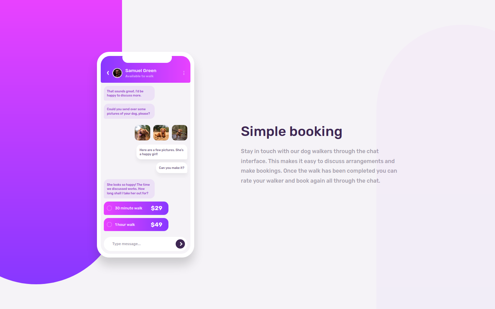

# Frontend Mentor - Chat app CSS illustration solution

This is a solution to the [Chat app CSS illustration challenge on Frontend Mentor](https://www.frontendmentor.io/challenges/chat-app-css-illustration-O5auMkFqY). Frontend Mentor challenges help you improve your coding skills by building realistic projects.

## Overview

### The challenge

Users should be able to:

-   View the optimal layout for the component depending on their device's screen size
-   **Bonus**: See the chat interface animate on the initial load

### Screenshot

### Links

-   Solution URL: [LINK](https://www.frontendmentor.io/solutions/app-illustration-with-animated-chat-mobile-first-workflow-rcCI9-w8L)
-   Live Site URL: [LINK](https://conradmcgrifter.github.io/app-illustration/)

## My process

### Built with

-   Semantic HTML5 markup
-   Flexbox
-   Mobile-first workflow

### What I learned

-   I learned about setTimeout javaScript method and I learned a little bit more about css animations. I normally use transition property to animate things but the control you get with keyframes was neccessary for animating the chat bubble. I also used margin: auto to position certain elements

### Useful resources

-   [how to make arrows with css](https://www.w3schools.com/howto/howto_css_arrows.asp)
-   [animated phone message typing bubble](https://codepen.io/s8770125/pen/yDmrb?editors=1100)
-   [how to add parameters to setTimeout method](https://stackoverflow.com/questions/1190642/how-can-i-pass-a-parameter-to-a-settimeout-callback) - In modern browsers (ie IE11 and beyond), the "setTimeout" receives a third parameter that is sent as parameter to the internal function at the end of the timer.
